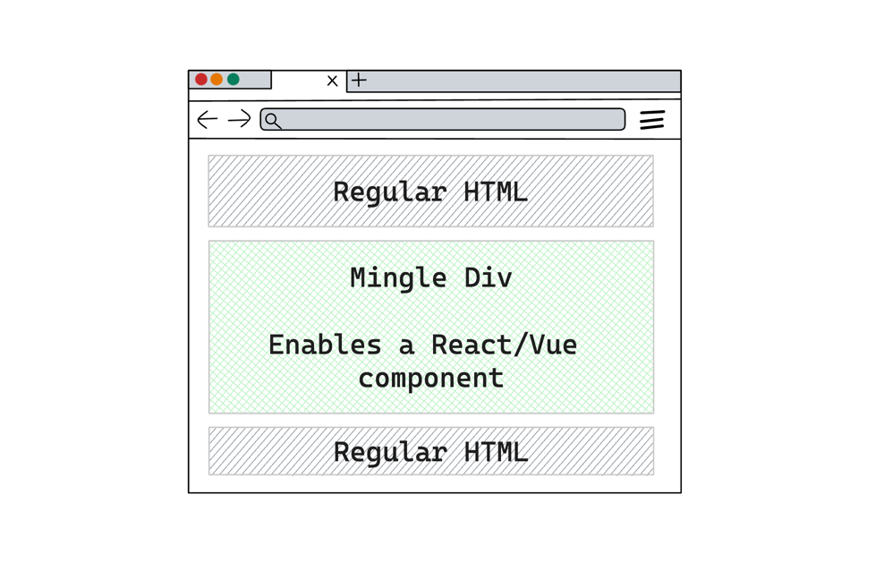
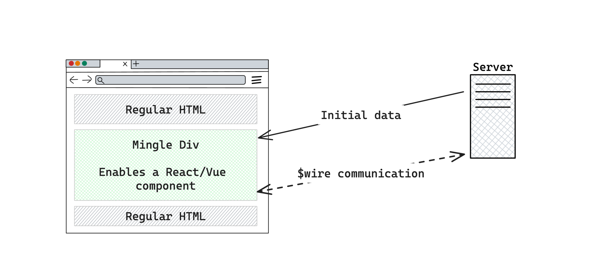

<svg fill="none" viewBox="0 0 600 300" width="600" height="300" xmlns="http://www.w3.org/2000/svg">
  <foreignObject width="100%" height="100%">
    

      

      

        <h1>Hi there, my name is Nikola 👋</h1>
      

    

  </foreignObject>
</svg>

# MingleJS

As you may already know, Livewire is a full-stack framework for Laravel that allows you to build dynamic interfaces using server-side code.
MingleJS allows you to use React/Vue components in your Livewire application, so you can use the best of both worlds.

## How is it working?

MingleJS renders a `div` on the server-side, and then mounts the React/Vue component on the client-side. Each JS component is rendered by a Livewire compoenent, so you get an island of interactivity in your Livewire application, with the JS of your taste.

## Some included nicety features

In the backend component, you can pass data that the component will have access to on the frontend.

You can choose to keep using Ajax client - Axios/Fetch/etc.
But the reality is, for the most part, you can use the convenient way of making server actions, which is Livewire. You get to make server requests just by `$wire.addTodo(todo)`. Find below a simple diagram of how MingleJS works in a page.

## Documentation

You'll find the documentation on [WIP](https://WIP).

TODO: Add documentation link 

For any questions and suggestions regarding MingleJS, feel free to [create an issue on GitHub](https://github.com/spatie/laravel-medialibrary/issues).

## Changelog

Please see [CHANGELOG](CHANGELOG.md) for more information on what has changed recently.

## Contributing

Please see [CONTRIBUTING](CONTRIBUTING.md) for details.

## Credits

- [Joao Patricio](https://github.com/ijpatricio)
- [All Contributors](../../contributors)

## License

The MIT License (MIT). Please see [License File](LICENSE.md) for more information.
